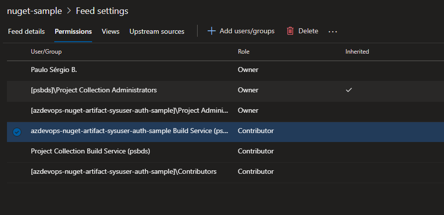
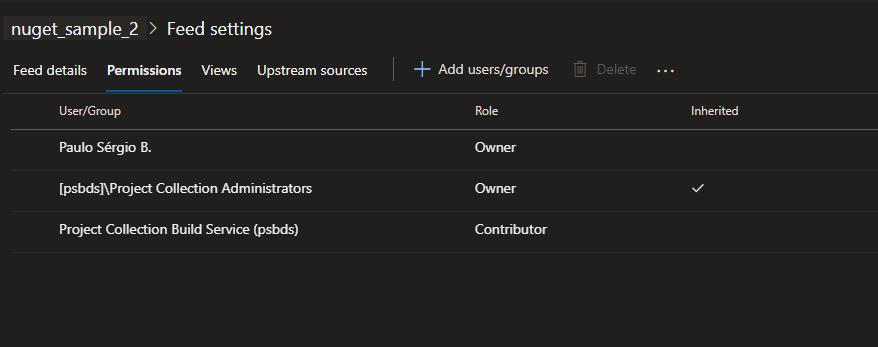

# Azure DevOps Artifacts(Nuget) - System User Authentication
A sample of how to deploy/download nuget packages from private Azure Artifacts using System users instead of PAT 


## Motivations

There some ways of authenticating through Azure Artifacts using system user. If you can use the ```DotNetCoreCLI@2``` task to build the project in the agent machine, Azure DevOps can automatically handle the authentication using the ```feedRestore``` parameter, you can find the documentation [here](https://docs.microsoft.com/en-us/azure/devops/pipelines/tasks/build/dotnet-core-cli?view=azure-devops)

But this option is not available if you're building your application without this task, like using docker as the build occurs inside the intermediate container, the most used way is using Personal Access Tokens (PAT) to enable the authentication.

This create two issues:

* The authentication of a service is being made using a personal token (if the user loses access to the project, the token will be invalidated and the service will not be able to build).

* Tthe maximum expiration time of a PAT is one year, so you'll need to refresh this token every year.

## Proposal

The proposal of this sample is to use the build service account from Azure DevOps to do this authentication.

When you create the first pipeline in your AzDevOps project a service account will be create using the names below, as explained [here](https://docs.microsoft.com/en-us/azure/devops/pipelines/process/access-tokens?view=azure-devops&tabs=yaml#job-authorization-scope)

* ```Project Collection Build Service ({OrgName})``` for a collection-scoped identity

* ```{Project Name} Build Service ({Org Name})``` for a project-scoped identity

The last one is used in your pipelines to authenticate with the AzDevOps REST API, like updating the status of a job and can also be used to authenticate with the Artifact Feed.

You can get the token for this user in your pipelines using the variable [System.AccessToken](https://docs.microsoft.com/en-us/azure/devops/pipelines/build/variables?view=azure-devops&tabs=yaml#systemaccesstoken), so you can use this token that will belong to a Service User and always be updated instead of using a PAT.

## Tradeoffs

There are two majors tradeoffs of using this approach:

1. The build service account has more permissions than only accessing the artifact feed, so a leak of this token will be a issue not only for the feed but for the AzDevOps project.

2. In the case of Docker, as the token will be always refreshing you will lose some of the layer caching capabilities when building a image


## How to do it

In this repository you find a sample of how to deploy an artifact using the approach above

### 1 Step - Checking the Artifact feed permissions

If you're using a project scoped artifact feed, all the permissions are automatically configured.



If you're using a organization scoped artifact feed, you'll need to add the the Build Service Account in the permissions list as contributor


### 2 Step - Deploying the Library

The next step is to deploy the library, you can find the sample [here](https://github.com/psbds/azdevops-nuget-artifact-sysuser-auth-sample/blob/master/build-library.yaml)

We basically run 4 steps:
1. Build the project
2. Pack the nuget library
3. Add the Artifact Feed source
4. Push the the library to the source

You can notice that instead of using a PAT token, were using the service account token through ```System.AccessToken```

```  
- task: DotNetCoreCLI@2
  displayName: 'Build Project'
  inputs:
    command: 'build'
    projects: 'library/**/*.csproj'
    arguments: '-c Release'

- task: DotNetCoreCLI@2
  displayName: 'Pack Project'
  inputs:
    command: 'pack'
    packagesToPack: 'library/**/*.csproj'
    configuration: 'Release'
    versioningScheme: 'byEnvVar'
    versionEnvVar: 'version'
    
- task: DotNetCoreCLI@2
  displayName: 'Add Nuget Source'
  inputs:
    command: 'custom'
    custom: 'nuget'
    arguments: 'add source $(nuget_server) -n $(nuget_name) -u $(nuget_name) -p "$(System.AccessToken)" --store-password-in-clear-text'

- task: DotNetCoreCLI@2
  displayName: 'Push to Nuget Source'
  inputs:
    command: 'custom'
    custom: 'nuget'
```

### 3 Step - Adding the Source Feed in your Dockerfile
The next step is to modify your Dockerfile so it can add the private artifact feed and be able to authenticated, you can find the sample [here](https://github.com/psbds/azdevops-nuget-artifact-sysuser-auth-sample/blob/master/app/Dockerfile).

In this case we receive the parameters ```nuget_name```, ```nuget_server```, ```nuget_user``` and ```nuget_password``` in our ```docker build``` command and add the artifact source in the image.

```
ARG nuget_name
ARG nuget_server
ARG nuget_user
ARG nuget_password
RUN dotnet nuget add source $nuget_server -n $nuget_name -u $nuget_user -p "$nuget_password" --store-password-in-clear-text
```

Obs: ```--store-password-in-clear-text``` is there as password encryption is not available on non-windows hosts

```  Password decryption is not supported on .NET Core for this platform. The following feed uses an encrypted password: '****'. You can use a clear text password as a workaround.```

### 4 Step - Build our App Docker Image

The next step is to build our docker image in Azure Pipelines, you can find the sample [here](https://github.com/psbds/azdevops-nuget-artifact-sysuser-auth-sample/blob/master/build-app-docker.yaml)

```
steps:
- task: Docker@2
  inputs:
    command: 'build'
    Dockerfile: 'app/Dockerfile'
    buildContext: 'app'
    arguments: '--build-arg nuget_name=$(nuget_name) --build-arg nuget_server=$(nuget_server) --build-arg nuget_user=$(nuget_user) --build-arg nuget_password=$(System.AccessToken)'
```

The main change is on the line below, where we need to provide the authentication info for the image to build:

```
    arguments: '--build-arg nuget_name=$(nuget_name) --build-arg nuget_server=$(nuget_server) --build-arg nuget_user=$(nuget_user) --build-arg nuget_password=$(System.AccessToken)'
```
